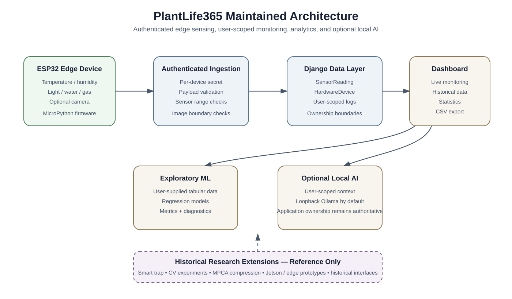

# PlantLife365 Architecture

## Purpose

This document describes the maintained PlantLife365 software architecture.

Historical experimental branches are documented separately and are not automatically part of the canonical runtime.

---

## Layer 1: Edge sensing

Canonical firmware:

`firmware/esp32/main.py`

The maintained ESP32/MicroPython firmware captures environmental measurements and can include optional imagery.

Device-specific configuration is stored locally in `firmware/esp32/config.py`.

A safe example is provided in `firmware/esp32/config.example.py`.

The private configuration file is excluded from Git.

---

## Layer 2: Device authentication and ingestion

Canonical ingestion logic:

`dashboard/device_ingestion.py`

The server validates:

- device identity
- device authentication
- required telemetry fields
- numeric values
- finite values
- application-level sensor ranges
- image payload boundaries where applicable

The server does not trust a device identifier by itself.

---

## Layer 3: Persistence

Primary maintained models include:

### SensorReading

Stores environmental telemetry associated with a device identifier.

### HardwareDevice

Represents registered hardware, ownership, activation state, and the protected device secret.

### SystemLog

Stores user-scoped system events and alerts.

### UserProfile

Stores application-level state associated with a Django user.

### UserSubscription

Represents prototype application-tier logic.

The maintained repository does not present this as completed payment processing.

---

## Layer 4: User-scoped data services

Canonical service:

`dashboard/data_services.py`

Responsibilities include:

- resolving devices owned by a user
- current sensor readings
- historical sensor records
- rolling statistics
- date-based queries
- export support
- user-scoped dashboard data

This layer is part of the repository's cross-user data-isolation boundary.

---

## Layer 5: Django web application

The web application provides:

- authentication
- account registration
- device registration
- monitoring dashboard
- historical visualization
- system logs
- CSV export
- exploratory analytics
- optional AI assistant access

Templates are maintained under `dashboard/templates/`.

---

## Layer 6: Exploratory machine learning

Canonical service:

`dashboard/ml_services.py`

The maintained ML layer is deliberately bounded.

It accepts tabular CSV or Excel input and exposes a defined set of regression algorithms.

The historical arbitrary-code execution interface is not part of the maintained architecture.

Outputs include:

- MAE
- RMSE
- R-squared
- actual-versus-predicted plots
- model-specific descriptive feature scores

The service is intended for exploration and software demonstration rather than validated agronomic forecasting.

---

## Layer 7: Optional local AI assistant

Canonical service:

`dashboard/assistant_service.py`

The assistant receives compact context belonging to the authenticated user.

The default endpoint policy permits loopback Ollama hosts.

Remote endpoints require explicit opt-in.

The language-model layer does not replace application ownership rules.

---

## Layer 8: Validation and CI

Local validation:

`scripts/validate.ps1`

Syntax validation:

`scripts/check_syntax.py`

Continuous integration:

`.github/workflows/ci.yml`

The automated workflow checks:

1. Python syntax
2. dependency consistency
3. Django system configuration
4. migration consistency
5. automated tests
6. Git whitespace

---

## End-to-End Data Flow

    Environmental sensors
            |
            v
    ESP32 / MicroPython
            |
            | authenticated telemetry
            v
    Django ingestion endpoint
            |
            | authenticate + validate
            v
    SensorReading / SystemLog
            |
            v
    User-scoped data services
            |
       +----+--------------------+
       |                         |
       v                         v
    Dashboard               CSV / statistics
       |
       +-------------------------+
       |                         |
       v                         v
    Exploratory ML         Optional local AI

---

## Trust Boundaries

### Physical-device boundary

Incoming device identity alone is not trusted.

### Browser-user boundary

Browser-facing functionality relies on Django authentication and CSRF protection where appropriate.

### Data-isolation boundary

Monitoring queries are scoped through hardware owned by the authenticated user.

### Analytics boundary

Uploaded tabular data may be analyzed only through explicitly implemented operations.

Arbitrary submitted server-side Python execution is disabled.

### AI boundary

The language model is an optional external component and does not determine database authorization.

### Historical-code boundary

Files under `research/historical_reference/` are not imported into the canonical runtime.

---

## Deployment Limitations

PlantLife365 is a research/development baseline.

A hardened production deployment would additionally require decisions concerning:

- HTTPS/TLS termination
- production database infrastructure
- hardened secret management
- production web-server configuration
- rate limiting
- monitoring and observability
- deployment-specific network security
- device provisioning
- backup and recovery
- physical-hardware validation
- field-operating validation
